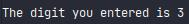

# Digit Recognizer

Digit Recognizer provides you an ability to draw a digit and get its predicted value from a Neural Net 
model with a very simple interface.

Run run.py and draw the ugliest digit you can, and the model will classify it with 95% accuracy!

## Example

Drawn digit:

Prediction:

## Methods and tools
* Data Manipulation - Pandas, Numpy, PIL
* Modeling - Keras, sklearn
* Graphics - pygame
* Low amount of training data - ~4000 samples (Compared to 60000 samples in MNIST)
* Deployment - docker

## Technical Details
The model is a CNN trained on only 3000 digits from MNIST dataset and additional ~1000 digits drawn by me. 
The model building and training perform in src/modeling/model.py.

The additional digits are needed because MNIST doesn't perfectly emulate digits drawn by a computer mouse/touchpad. Hence, handmade data was necessary to build a digit recognizer with high accuracy. Handmade data was built using src/data/expand_dataset.py module.

I used pygame library for GUI to get an input image of a digit from the user. run.py implements all the pygame part and after the user draws a digit run.py calls prediction.py to get the prediction from the model.

## Not-a-digit Recognition (experimental)
You can draw anything and the Neural Net will tell you if it's a digit, and if so, which one.
